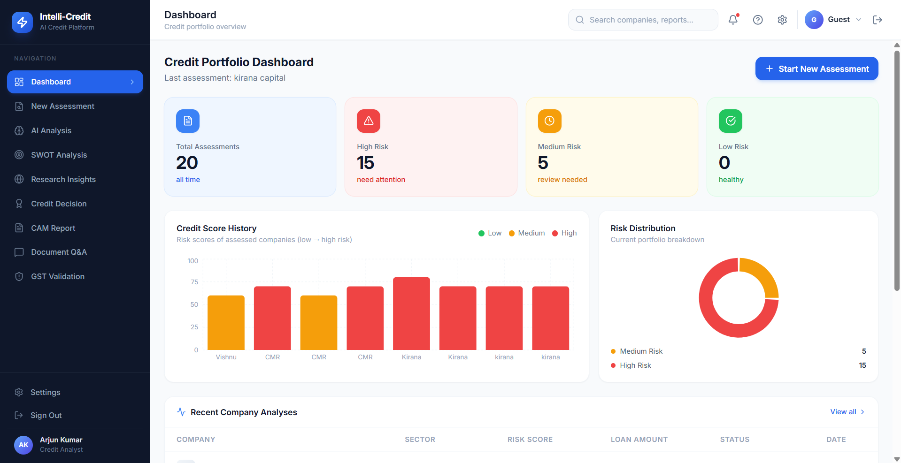
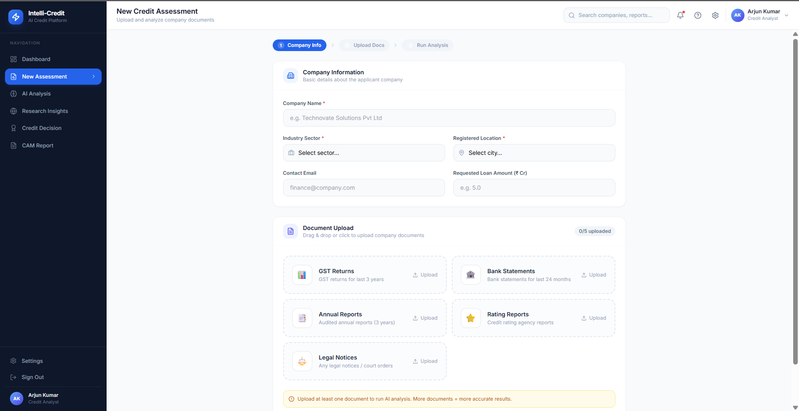
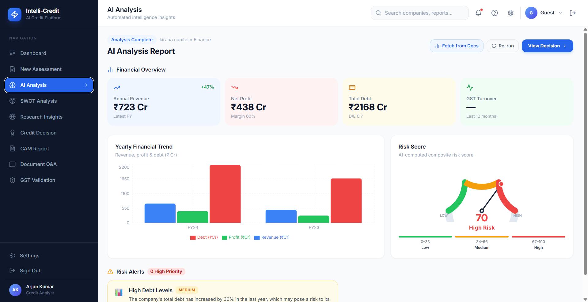
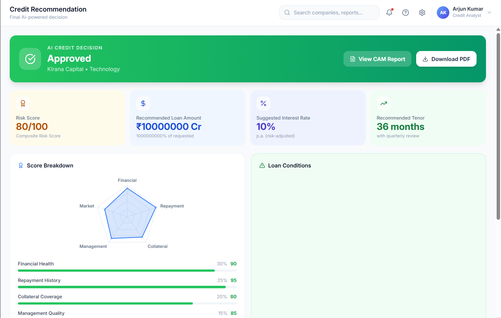

# IntelliCredit — AI-Powered Corporate Credit Appraisal Engine

> **IIT Hyderabad Hackathon — Intelli-Credit Challenge**
> Theme: *Next-Gen Corporate Credit Appraisal: Bridging the Intelligence Gap*

---

## Overview

**IntelliCredit** is an end-to-end AI credit decisioning engine that automates the preparation of a **Comprehensive Credit Appraisal Memo (CAM)** for mid-sized Indian corporates. It ingests multi-format financial documents, runs a full RAG-powered analysis pipeline, performs real-time web research, and produces an explainable credit decision — all in minutes instead of weeks.

---

## Key Features

### Document Intelligence Pipeline
- **Multi-Format Ingestion** — PDF (annual reports, legal notices, sanction letters) and Excel (ALM statements, portfolio cuts) via PyMuPDF + openpyxl + reportlab
- **LLM Auto-Classification** — Groq LLaMA 3.3-70b automatically identifies document types (Annual Report, GST Returns, Borrowing Profile, Shareholding Pattern, Bank Statement, ALM) before indexing
- **Dynamic Semantic Chunking** — LLM-driven section boundary detection instead of fixed-size token splits; preserves financial context across tables, footnotes, and multi-page disclosures
- **Token-Aware Batching** — tiktoken-based token counting with configurable `TOKEN_THRESHOLD` prevents context overflow during chunking LLM calls
- **SentenceTransformer Embeddings** — `all-MiniLM-L6-v2` encodes every semantic chunk into 384-dim dense vectors
- **FAISS Vector Store** — In-memory flat L2 index with persistent `faiss_index.bin` + `faiss_metadata.json` for sub-millisecond nearest-neighbor retrieval

### RAG Pipeline (Retrieval-Augmented Generation)
- **Dynamic top-k Retrieval** — Query complexity detection boosts `top_k` up to 15× for broad financial questions; standard queries use baseline `k=5`
- **3× Over-Fetch + Score Filtering** — Fetches 3× candidates before re-ranking by cosine similarity so the final context is always the most relevant
- **Token-Budget Context Packing** — Retrieved chunks are truncated to a strict `_MAX_CONTEXT = 3500` token window, keeping every Groq call within the 128k context limit
- **Grounded Document Q&A** — Natural-language queries over indexed documents: *"What is the DSCR?"*, *"Are there any litigation risks?"* — answers cite evidence from actual uploaded financials
- **Form Field Auto-Extraction** — `/assess/extract-form` uses RAG to auto-populate revenue, debt, profit, and GSTIN fields from indexed documents

### Web Search & Secondary Research
- **Serper API Integration** — Parallel Google web + news searches across six research dimensions: company news, financial intelligence, litigation & regulatory filings, MCA records, promoter background, and sector trends
- **AI Research Synthesis** — Groq LLM synthesizes raw web results into structured risk insights with severity ratings (High / Medium / Low) and actionable summaries
- **Custom Search** — Analysts can run free-form web queries from the Research Insights panel
- **Real-Time Intelligence** — Surfaces delayed GST filings, court judgements, SEBI actions, RBI penalties, and sector headwinds from live web data

### Credit Assessment Engine
- **Structured Credit Scoring** — Composite risk score (0–100) across five weighted dimensions: Financial Health (30%), Repayment History (25%), Collateral Coverage (20%), Management Quality (15%), Market Position (10%)
- **Multi-Query RAG Context** — Four targeted FAISS queries per assessment dimension ensure the LLM has relevant evidence for every scoring factor
- **Explainable AI Decisions** — Full 3–4 paragraph AI reasoning narrative describes *why* a specific loan amount, rate, and tenor were recommended
- **Loan Conditions & Covenants** — Auto-generates specific monitoring requirements and conditions precedent attached to each sanction
- **Risk Alert Generation** — Automatically flags High Debt Ratio, GST mismatches, litigation exposure, NPA indicators, and sector-specific headwinds

### SWOT Analysis
- **RAG-Powered SWOT** — Multi-query retrieval across financial, management, market, and compliance dimensions feeds a structured Strengths / Weaknesses / Opportunities / Threats analysis
- **Sector-Aware Reasoning** — LLM applies sector-specific knowledge (manufacturing capex, pharma regulatory risk, infrastructure project risk) to SWOT items

### GST Cross-Validation
- **GSTR-2A vs 3B Reconciliation** — Compares reported turnover across GST returns and bank statements to flag circular trading, revenue inflation, and ITC mismatch
- **Indian Compliance Context** — Prompts explicitly reference GSTIN, GSTR-2A/3B, e-Way bills, and RBI/MCA norms

### CAM Report Generation
- **Full Credit Appraisal Memo** — AI-generated expandable memo with Company Overview, Financial Analysis, Risk Assessment (5Cs of Credit), Credit Decision, and Compliance & Due Diligence sections
- **PDF Export** — One-click PDF generation via jsPDF with professional A4 layout, color-coded risk indicators, and bank-ready formatting
- **DOCX Export** — Downloadable Word document for further editing by the credit team

### Primary Insight Portal
- **Qualitative Due Diligence Input** — Credit officers enter factory/site visit observations, management interview notes, market/supplier feedback, and operational findings
- **AI Score Adjustment** — Primary insights are embedded into the assessment context so the LLM adjusts risk scores for on-ground findings (e.g., *"Factory operating at 40% capacity"*)

### Portfolio Dashboard
- **Credit History Tracking** — Persisted assessment history with risk-banded bar charts (last 8 assessments) and real-time risk distribution pie chart
- **Portfolio Stats** — Total assessments, High/Medium/Low risk counts with drill-down company table

---

## Architecture

```
┌─────────────────────────────────────────────────────────────┐
│                        React Frontend                        │
│  Dashboard · New Assessment · AI Analysis · CAM Report       │
│  Credit Recommendation · Research Insights · SWOT · GST     │
└────────────────────────┬────────────────────────────────────┘
                         │  REST API (FastAPI)
┌────────────────────────▼────────────────────────────────────┐
│                       FastAPI Backend                        │
│                                                              │
│  /documents   → PyMuPDF extraction → Dynamic chunking       │
│               → SentenceTransformer embeds → FAISS index    │
│                                                              │
│  /query       → RAG retrieve (FAISS) → Groq LLM answer      │
│                                                              │
│  /assess      → Multi-query RAG → credit_scorer → JSON      │
│                                                              │
│  /research    → Serper web search → Groq synthesis          │
│                                                              │
│  /swot        → RAG retrieval → SWOT structured output      │
│                                                              │
│  /gst         → GST cross-validation → mismatch alerts      │
│                                                              │
│  /cam         → Full CAM memo generation → PDF/DOCX export  │
└──────────────────────────────────────────────────────────────┘
```

---

## Tech Stack

### Frontend
| Technology | Purpose |
|---|---|
| **React 19** | UI framework |
| **Tailwind CSS** | Utility-first styling |
| **Recharts** | Financial bar charts, radar charts, pie charts |
| **jsPDF** | Client-side PDF CAM export |
| **Lucide React** | Icon library |
| **Supabase** | Authentication |

### Backend
| Technology | Purpose |
|---|---|
| **FastAPI** | REST API framework with async support |
| **Groq API — LLaMA 3.3-70b-Versatile** | Dynamic chunking, RAG answering, credit scoring, SWOT, GST validation |
| **PyMuPDF (fitz)** | PDF text extraction, page-level text blocks |
| **SentenceTransformers** | `all-MiniLM-L6-v2` — 384-dim semantic embeddings |
| **FAISS (faiss-cpu)** | In-memory vector similarity search index |
| **tiktoken** | Token counting (cl100k_base ≈ LLaMA tokenizer) |
| **Serper API** | Google web + news search for secondary research |
| **openpyxl + reportlab** | Excel ingestion → PDF conversion pipeline |
| **python-docx** | DOCX CAM report generation |
| **python-dotenv** | Environment variable management |

---

## Project Structure

```
intelli_credit/
├── images/                 # Product screenshots (ss1–ss7)
├── frontend/               # React application
│   └── src/
│       ├── api.js                        # API client — upload, assess, RAG query, charts, research
│       ├── supabase.js                   # Supabase auth client
│       ├── pages/
│       │   ├── Dashboard.jsx             # Portfolio overview + risk distribution charts
│       │   ├── NewCreditAssessment.jsx   # Document upload + dynamic chunking pipeline trigger
│       │   ├── AIAnalysis.jsx            # Risk gauge + financial KPI cards + alert panel
│       │   ├── CreditRecommendation.jsx  # Final decision + RadarChart score breakdown
│       │   ├── CAMReport.jsx             # Full CAM memo + PDF/DOCX export
│       │   ├── ResearchInsights.jsx      # RAG Q&A panel + web research synthesis
│       │   ├── SWOTAnalysis.jsx          # AI-generated SWOT grid
│       │   ├── GSTCrossValidation.jsx    # GST vs. bank statement reconciliation
│       │   ├── DocQuery.jsx              # Free-form document query (RAG)
│       │   └── AuthPage.jsx              # Supabase login / register
│       └── components/
│           ├── Sidebar.jsx               # Navigation rail
│           └── TopNav.jsx                # Top bar with company context
│
└── backend/                # FastAPI application
    ├── main.py              # App entry point + CORS + lifespan (embedding model preload)
    ├── requirements.txt
    ├── .env                 # GROQ_API_KEY, SERPER_API_KEY, config (not committed)
    ├── routers/
    │   ├── documents.py     # POST /documents/classify, /documents/process
    │   ├── query.py         # POST /query  (RAG document Q&A)
    │   ├── assess.py        # POST /assess, /assess/extract-form
    │   ├── charts.py        # POST /charts/financial
    │   ├── research.py      # POST /research/full, /research/custom, /research/synthesize
    │   ├── cam.py           # POST /cam/generate, /cam/docx
    │   ├── gst_validate.py  # POST /gst/validate
    │   └── swot.py          # POST /swot/generate
    └── services/
        ├── document_processor.py  # Extract → Dynamic chunk → Embed → FAISS
        ├── rag_service.py         # Dynamic top-k retrieval + token-budget context packing
        ├── credit_scorer.py       # Multi-query RAG → structured credit JSON via Groq
        ├── chart_service.py       # Financial chart data extraction from indexed docs
        ├── web_search_service.py  # Serper API — 6-dimension secondary research
        └── groq_retry.py          # Exponential backoff retry wrapper for Groq API calls
```

---

## API Endpoints

| Method | Endpoint | Description |
|---|---|---|
| `POST` | `/documents/classify` | Extract text + LLM-classify document type (no indexing) |
| `POST` | `/documents/process` | Full ingestion: PDF/Excel → dynamic chunking → FAISS index |
| `POST` | `/query` | RAG Q&A — natural-language question over indexed documents |
| `POST` | `/assess` | Full credit assessment: multi-query RAG + LLM scoring |
| `POST` | `/assess/extract-form` | Auto-extract form fields from indexed documents via RAG |
| `POST` | `/charts/financial` | Extract yearly revenue / profit / debt trends for charts |
| `POST` | `/research/full` | 6-dimension Serper web research for a company |
| `POST` | `/research/custom` | Free-form web or news search |
| `POST` | `/research/synthesize` | Groq synthesis of web research into risk insights |
| `POST` | `/swot/generate` | RAG-powered SWOT analysis |
| `POST` | `/gst/validate` | GST cross-validation and reconciliation |
| `POST` | `/cam/generate` | Full CAM memo generation |
| `POST` | `/cam/docx` | Download CAM as DOCX |
| `GET`  | `/health` | Liveness probe |

---

## Getting Started

### Prerequisites
- Python 3.10+
- Node.js 18+
- [Groq API key](https://console.groq.com) — LLaMA 3.3-70b inference
- [Serper API key](https://serper.dev) — Google web search (for Research Insights)

### Backend Setup

```bash
cd backend
pip install -r requirements.txt
```

Create a `.env` file in `backend/`:

```env
GROQ_API_KEY=your_groq_api_key
SERPER_API_KEY=your_serper_api_key
FAISS_INDEX_PATH=faiss_index.bin
FAISS_METADATA_PATH=faiss_metadata.json
TOKEN_THRESHOLD=2000
EMBEDDING_MODEL=all-MiniLM-L6-v2
GROQ_MODEL=llama-3.3-70b-versatile
ALLOWED_ORIGINS=http://localhost:3000
```

```bash
uvicorn main:app --reload --port 8000
```

### Frontend Setup

```bash
cd frontend
npm install
npm start
```

The app runs at `http://localhost:3000` and connects to the backend at `http://localhost:8000`.

Set `REACT_APP_API_URL` in `frontend/.env` to point to a deployed backend.

---

## Screenshots

### Dashboard — Portfolio Overview

Credit portfolio overview with **Risk Score History** bar chart (last 8 assessments, color-coded Low/Medium/High), **Risk Distribution** pie chart, and assessment stats cards (Total Assessments, High Risk, Medium Risk, Low Risk). Start a new assessment directly from the dashboard.

---

### New Credit Assessment — Document Upload & Pipeline Trigger

Multi-document intake form with drag-and-drop file upload for Annual Reports, ALM Statements, Shareholding Patterns, Borrowing Profiles, and Portfolio data (PDF/Excel). LLM auto-classifies each uploaded document before indexing. Supports primary due diligence notes (factory visits, management interviews, market feedback). Triggers the full pipeline: text extraction → dynamic semantic chunking → FAISS vector indexing → AI credit scoring.

---

### AI Analysis — Risk Gauge & Financial Intelligence

Deep-dive financial intelligence screen featuring a custom **SVG Risk Score Gauge** (0–100, Low/Medium/High bands), **Financial Overview KPI cards** (Annual Revenue, Net Profit, Total Debt, GST Turnover extracted via RAG), **Yearly Financial Trend** grouped bar chart (Revenue / Profit / Debt in ₹ Cr), and auto-generated **Risk Alert cards** with High/Medium/Low severity indicators. Profitability metrics include Gross Margin, Net Margin, ROE, DSCR, D/E Ratio, and Interest Coverage.

---

### Credit Recommendation — Explainable Credit Decision

Final credit decision with **Approve / Conditional Approval / Reject** badge, recommended loan amount and interest rate. **Score Breakdown RadarChart** (pentagon across 5 dimensions with weighted score bars) and full **AI Reasoning narrative** explaining the decision. Lists specific loan conditions and covenants attached to the sanction.

---

### CAM Report — Comprehensive Credit Appraisal Memo

AI-generated **Credit Appraisal Memo** in expandable accordion sections: Company Overview, Financial Analysis (ratio analysis, trend analysis, DSCR, DER), 5Cs of Credit (Character, Capacity, Capital, Collateral, Conditions), Risk Assessment, and Credit Decision. Supports **one-click PDF export** (jsPDF) and **DOCX download** for bank-ready document formatting.

---

### Research Insights — RAG Q&A + Web Intelligence

Dual-mode research panel. **Document Q&A (RAG)**: ask natural-language questions over indexed documents — answers are grounded in retrieved FAISS chunks with evidence citations. **Secondary Web Research**: Serper-powered search across 6 dimensions (company news, financials, litigation, MCA filings, promoter background, sector trends) synthesized by Groq into structured risk insights with severity ratings.

---

### SWOT Analysis & GST Cross-Validation

**SWOT Analysis**: RAG-powered Strengths / Weaknesses / Opportunities / Threats grid generated from indexed document context with sector-aware LLM reasoning. **GST Cross-Validation**: GSTR-2A vs 3B reconciliation flagging turnover mismatches, ITC discrepancies, circular trading indicators, and compliance gaps against RBI/MCA norms.

---

## How It Works — Pipeline Deep Dive

### 1. Document Ingestion
```
PDF/Excel Upload
    → PyMuPDF text extraction (page-level blocks)
    → LLM Auto-Classification (Groq — one-shot, 20 tokens)
    → Token counting (tiktoken cl100k_base)
    → Dynamic Semantic Chunking
         ├─ If tokens ≤ TOKEN_THRESHOLD → single chunk
         └─ Else → LLM identifies section boundaries → split at headings
    → SentenceTransformer encode (all-MiniLM-L6-v2 → 384-dim)
    → FAISS flat index add + metadata persist
```

### 2. RAG Query
```
User Question
    → SentenceTransformer encode query
    → FAISS search (3× over-fetch, dynamic top-k up to 15)
    → Re-rank by cosine similarity
    → Token-budget packing (≤ 3500 tokens context)
    → Groq LLM (LLaMA 3.3-70b) — grounded answer with citations
```

### 3. Credit Assessment
```
Company Name + Sector + Loan Amount
    → 4 targeted FAISS queries (financial, debt, compliance, management)
    → Multi-chunk context assembly with token-budget enforcement
    → Groq LLM → structured JSON credit decision
         ├─ risk_score (0–100)
         ├─ decision (approved / conditional / rejected)
         ├─ recommended_loan_cr + interest_rate_pct + tenor_months
         ├─ score_breakdown (5 weighted dimensions)
         ├─ conditions + risk_alerts
         ├─ financial_overview + yearly_trend
         └─ reasoning (3–4 paragraph narrative)
```

### 4. Secondary Research
```
Company Name + Sector
    → Serper API — 6 parallel search dimensions
         ├─ Company news (Google News)
         ├─ Financial intelligence
         ├─ Litigation & court records
         ├─ MCA / regulatory filings
         ├─ Promoter background
         └─ Sector trends
    → Groq LLM synthesis → structured risk insights + severity ratings
```

---

## Environment Variables

| Variable | Description | Default |
|---|---|---|
| `GROQ_API_KEY` | Groq API key for LLaMA 3.3-70b | required |
| `SERPER_API_KEY` | Serper API key for web search | required for research |
| `GROQ_MODEL` | Groq model name | `llama-3.3-70b-versatile` |
| `EMBEDDING_MODEL` | SentenceTransformer model | `all-MiniLM-L6-v2` |
| `FAISS_INDEX_PATH` | Path for persisted FAISS index | `faiss_index.bin` |
| `FAISS_METADATA_PATH` | Path for chunk metadata JSON | `faiss_metadata.json` |
| `TOKEN_THRESHOLD` | Max tokens before chunking kicks in | `2000` |
| `ALLOWED_ORIGINS` | CORS origins (comma-separated) | `http://localhost:3000` |
| `RAG_TOP_K` | Base number of chunks to retrieve | `5` |
